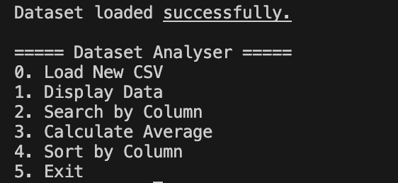
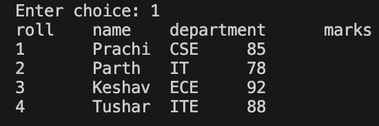
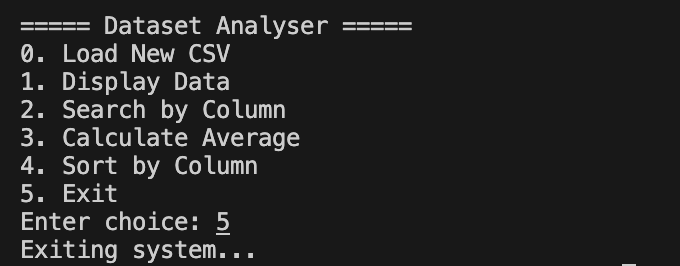

# Dataset Analyser System

## Description
Dataset Analyser is a Java-based program that allows users to load any CSV dataset and perform basic data analysis operations.  
It uses OOPS concepts, file handling, and dynamic data structures to manage and process datasets.

## Features
- Load any CSV dataset
- Display the entire dataset in tabular form
- Search records by column value
- Calculate the average of numeric columns
- Sort data by any column
- Works with dynamic datasets (you can upload your own CSV files)

## Menu Output

## Display Dataset

## Search Data

## Avergae

## Sort Data

## Exiting Dataset

## Author
Prachi Aggarwal,
Parth Singhal
