## Design and Implementation of a Flexible CSV-Driven Data Analysis and Interest-Based Career Recommendation System Using Object-Oriented Programming in Java

## Description
Dataset Analyser is a Java-based program that allows users to load any CSV dataset and perform basic data analysis operations.  
It uses OOPS concepts, file handling, and dynamic data structures to manage and process datasets.

## Features
- Load any CSV dataset
- Display the entire dataset in tabular form
- Search records by column value
- Calculate the average of numeric columns
- Sort data by any column
- Works with dynamic datasets (you can upload your own CSV files)

## Menu
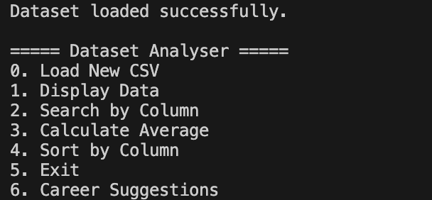

## Display Data
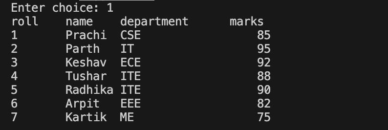

## Search Data
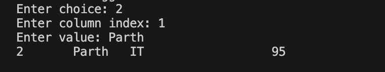

## Calculate Average
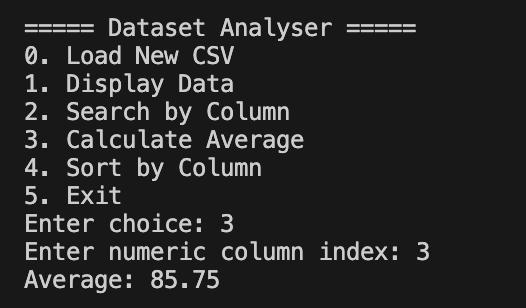

## Sort Data
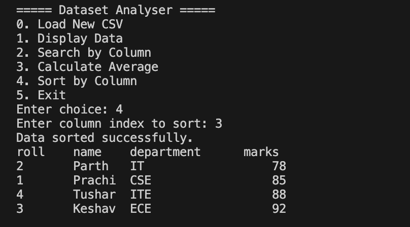

## Career Suggestions (Coding)
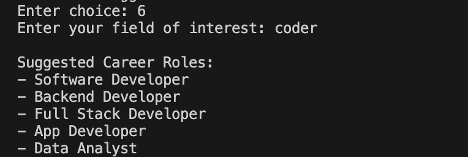

## Career Suggestions (Business)

## Career Suggestions (Designer)
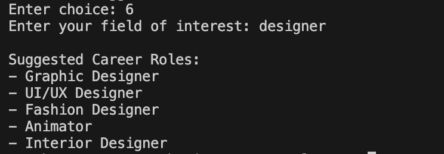

## Career Suggestions (Journalist)
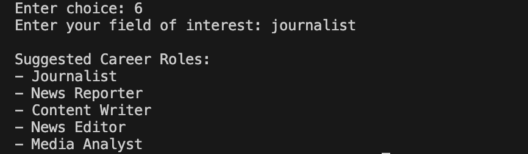

## Career Suggestions (Politician)
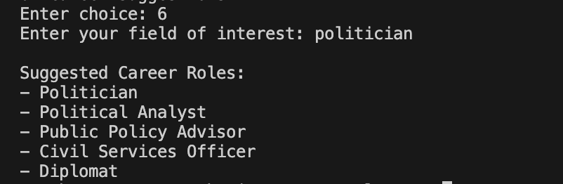

## Career Suggestions (Social)
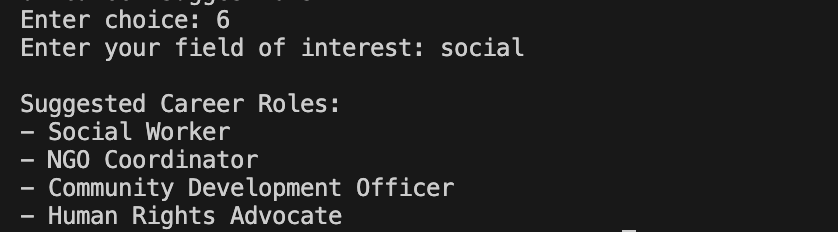

## Career Suggestions (Psycho)

## Career Suggestions (Sport)
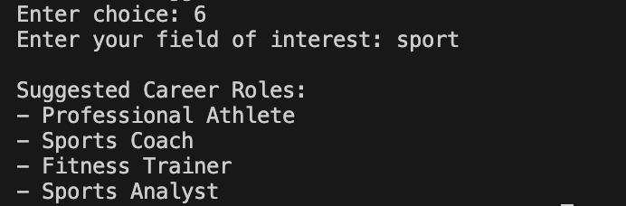

## Career Suggestions (Defence)
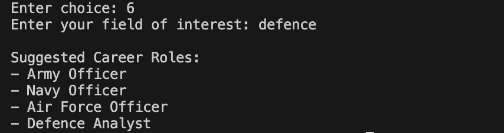

## Author
Prachi Aggarwal,
Parth Singhal
